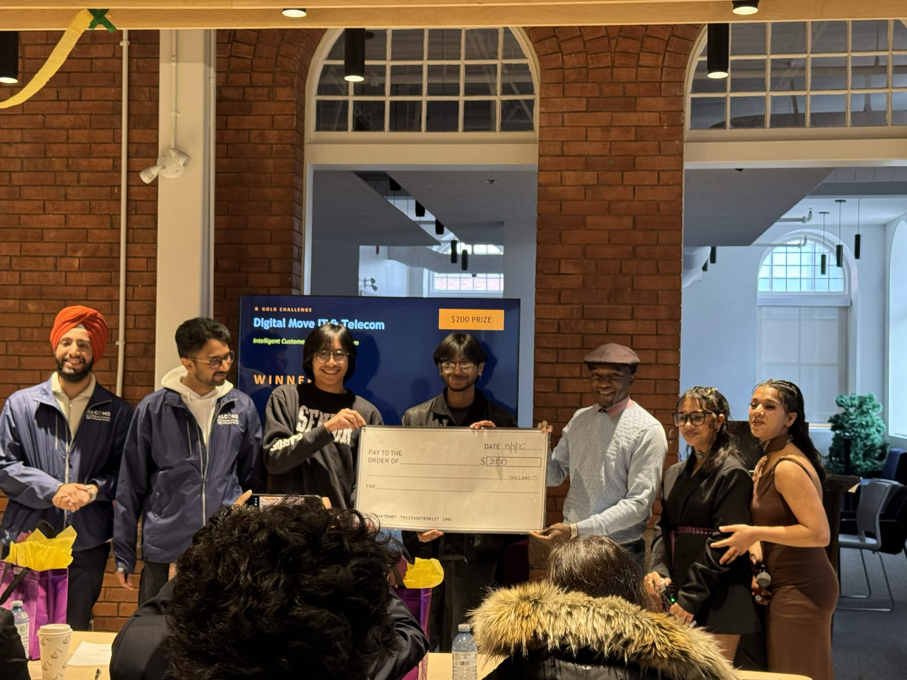

<div align="center">


 <h1>RetainIQ</h1>
<strong>Know who's leaving. Reach them first.</strong>
<br /><br />

<strong><a href="https://retainiq-thunderhacks-2026.vercel.app">Live Demo</a> · <a href="https://github.com/ellitellicity-commits/retainiq-thunderhacks-2026">GitHub</a></strong>

</div>

---

RetainIQ is a customer retention intelligence platform built for **Digital Move IT & Telecom** in 24 hours at ThunderHacks 2026. It watches your entire customer base in real time — scoring churn risk, mapping customer journeys, and drafting personalized outreach — so your sales team stops reacting and starts preventing.

<div align="center">

### Gold Sponsor Challenge Winner — ThunderHacks 2026



<sub>Winning the Digital Move Gold Sponsor Challenge · ThunderHacks 2026</sub>

</div>

---

## The Product

**Dashboard** — Live churn risk scores across every account, filterable by plan and risk level. Click any customer for an inline profile snapshot. Animated KPI cards and a colour-coded bar chart update as you filter.

**Customer Intelligence** — A sortable, searchable table with mini sparkline trends, risk score bars, and plan badges. Click any row to expand a detail panel: six stats, a risk gauge, and a visual journey stage indicator — all inline, no page reload.

**Journey Map** — Four stages rendered as a live pipeline: Onboarded, Active, At-Risk, Churned. Click any stage to see exactly who is there, their risk scores, and the average health of that cohort.

**Lifecycle** — A carousel of all 25 customers. Select anyone and scroll through a three-act narrative of their engagement decline. A sticky profile card morphs smoothly between Active, Warning, and Critical states — powered by Framer Motion.

**Alert Center** — The accounts that need a call today. A Mac-style terminal panel drafts personalized retention emails for high-risk accounts on demand.

---

## How It Works

The ML model trains on spend, login frequency, days since last contact, support ticket volume, and contract length. It outputs a probability score for every customer on startup. The email engine assembles copy from a pool of personas, openers, value props, and CTAs — producing thousands of unique combinations without a single API call.

---

## Stack

| Layer | Technologies |
|:---|:---|
| **Frontend** | React · Framer Motion · Recharts |
| **Backend** | Python · Flask · Flask-CORS |
| **Intelligence** | scikit-learn · Pandas · NumPy |
| **Typography** | Space Mono · DM Sans |
| **Deployment** | Vercel (Frontend) · Render (Backend) |

---

## Sponsor Pillars — Digital Move

| Capability | Implementation |
|:---|:---|
| **Predictive churn scoring** | Logistic regression model, score 0–100 per account |
| **Automated outreach drafts** | Template engine, unique copy on every generation |
| **Customer journey mapping** | Four-stage visual pipeline with expandable cohorts |
| **Real-time alerts dashboard** | Alert Center with risk meters and live email drafting |

---

## Running Locally

**Backend**

```bash
cd retainiq-thunderhacks-2026
pip install -r requirements.txt
python app.py
# → http://localhost:5000
```

**Frontend**

```bash
cd retainiq-thunderhacks-2026/frontend
npm install && npm start
# → http://localhost:3000
```

**Demo credentials** · *for demonstration purposes only*

```
Username: digitalmove
Password: retainiq2026
```

---

## Deployment Notes

The frontend is deployed on **Vercel** and the backend on **Render**. The backend runs on a free-tier service and may enter a sleep state after periods of inactivity. The first request can take **60–90 seconds** while the service wakes; subsequent requests are significantly faster.

To pre-warm the backend before a demo, visit `https://retainiq-thunderhacks-2026.onrender.com/api/customers`

---

<div align="center">

**Ellison Naz** · **Rishav Bawa**

<sub>ThunderHacks 2026 · Algoma University · March 2026</sub>

<sub>Built with focus and very little sleep.</sub>

</div>
